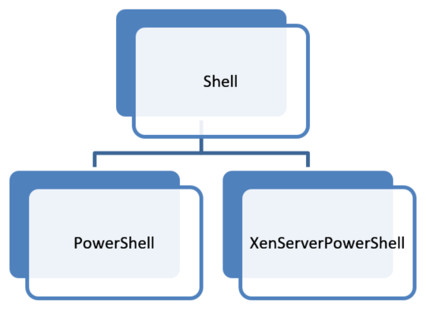
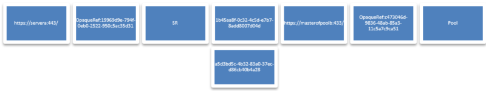
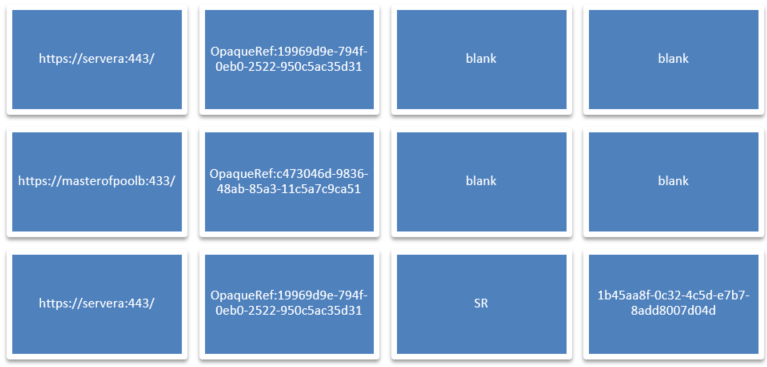
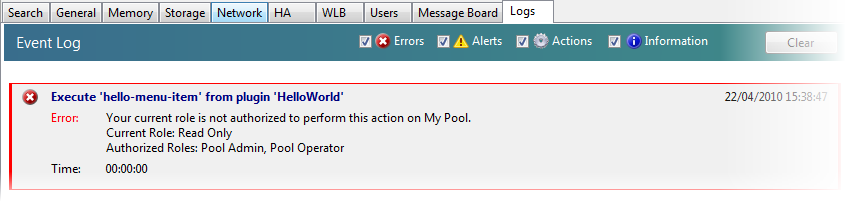

# Commands

In your configuration file, each MenuItem feature should have a single command as a child. They detail which executable or script to run when the user clicks the MenuItem.

In this version of the XenCenter plug-in specification there are three types of command:

-  Shell
-  PowerShell
-  XenServerPowerShell

PowerShell and XenServerPowerShell are extensions of Shell and inherit all the properties of Shell. However, they both have additional features which make it easier to run PowerShell scripts, for example XenServerPowerShell commands automatically load the Citrix Hypervisor PowerShell Module (XenServerPSModule) before executing.



## Commands: Parameter Sets

A parameter set is a collection of 4 parameters that are used to describe which items are selected in the XenCenter resource list when your command is executed.

While each command has its own way of receiving parameters from XenCenter, the parameters will always be the same. They are delivered in sets of four which  describe the selection in the XenCenter resource list: url, sessionRef, class, and objUuid.

Two of the parameters are used to allow communication to the relevant server:

-  The `url` parameter indicates the address of the applicable standalone server or pool master
-  The `sessionRef` parameter is the session opaque ref that can be used to communicate with this server

Two of the parameters are used to describe which specific object is selected:

-  The `class` parameter is used to show the class of the object which is selected in the resource list
-  The `objUuid` parameter is the UUID of this selected object

**Example:** If you were to select both the local SR from a standalone server (Server A) and the pool node from a separate pool (Pool B), you would end up 2 parameter sets being passed into your plug-in:



In general, you will receive one parameter set per object selected in the tree view, with two exceptions.

-  Selecting a folder will give add a parameter set per object in the folder, not the folder itself
-  Selected the XenCenter node will add a parameter set for each stand-alone server or pool that is connected, with the `class` and `objUuid` parameters marked with the keyword 'blank'

In this way, if the XenCenter node is selected you will be passed the necessary information to perform actions on any of the connected servers. However, selecting this node provides no contextual information about what the user wishes to target, so the 'blank' keyword is used for the parameters which would identify specifically what is selected.

**Example:** If you were connected to Server A and Pool B from the previous example, and you selected both the XenCenter node and the local storage on Server A you would get the following parameter sets:



### Commands: Shell

Shell commands are the most generic command type and launch executables, batch files and other files which have a registered Windows extension.

```xml
<?xml version="1.0" encoding="UTF-8"?>
<!DOCTYPE XenCenterPlugin PUBLIC "-//XENCENTERPLUGIN//DTD XENCENTERPLUGIN1//EN" "xencenter-1.dtd">

<XenCenterPlugin
      xmlns="http://www.citrix.com/XenCenter/Plugins/schema"
      version="1"
      plugin_version="1.0.0.0">

  <MenuItem
        name="hello-menu-item"
        menu="file"
        serialized="obj">

    <Shell
          filename="Plugins\Citrix\HelloWorld\HelloWorld.bat"
          window="true"
          log_output="true"
          dispose_time="0"
          param="{$type}" />

  </MenuItem>

</XenCenterPlugin>
```

### Commands: Shell Parameters

For Shell commands the parameter sets are passed through as command line parameters to the batch file or executable. Any additional parameters supplied using the 'param' xml attribute (see below) will be first in the list of parameters, followed by sets of four command line parameters representing each parameter set.

### Commands: Shell XML Attributes

> **Note:**
>
> The filename attribute is required and your plug-in will not load unless it is set.

| Key          | Value         | Description                                  | Optional/Required | Default | Accepts Placeholders |
|--------------|---------------|----------------------------------------------|-------------------|---------|----------------------|
| filename     | [string]      | The file that you wish to execute, for example an executable or a windows batch file. This is a relative path from your XenCenter install directory. | Required | - | True |
| window       | true or false | Whether to start the process in a window or run it in the background. | Optional | true | - |
| log_output   | true or false | Redirects the Standard Output and Standard Error streams of the plug-in process to the XenCenter log file. | Optional | false | - |
| param        | [string] | A comma separated string of extra parameters to pass to the process. You can pass a parameter with spaces by encasing it in XML escaped quotes (&amp;quot;) | Optional | - | True |
| dispose_time | [float]       | The grace period XenCenter should give the plug-in after it has requested it to cancel. After this period, XenCenter assumes the plug-in has hung and warns the user. | Optional | 20.0 | - |
| required_methods | [string]  | A comma separated string of API calls the plug-in wishes to run. XenCenter blocks the plug-in launch and warns the user when these requirements are not met due to a role restriction under RBAC. | Optional | - | False |
| required_method_list | [string] | The name of a list of methods called out in the MethodList node (child of XenCenterPlugin). If required_methods is set, this is ignored. Added in version 5.6 Feature Pack 1. | Optional | - | False |

For more information, see the section on RBAC protection.

## Commands: PowerShell

PowerShell commands specifically target PowerShell scripts and have several enhancements over a basic Shell command to help you access the various parameters XenCenter wishes to pass to your plug-in.

```xml
<?xml version="1.0" encoding="UTF-8"?>
<!DOCTYPE XenCenterPlugin PUBLIC "-//XENCENTERPLUGIN//DTD XENCENTERPLUGIN1//EN" "xencenter-1.dtd">

<XenCenterPlugin
      xmlns="http://www.citrix.com/XenCenter/Plugins/schema"
      version="1"
      plugin_version="1.0.0.0">

  <MenuItem
        name="hello-menu-item"
        menu="file"
        serialized="obj" />

    <PowerShell
          filename="Plugins\Citrix\HelloWorld\HelloWorld.ps1"
          debug="true"
          window="true"
          log_output="true"
          dispose_time="0"
          param="{$type}"
          function="Write-Output {$type}; read-host '[Press Enter to Exit]'" />

</MenuItem>

</XenCenterPlugin>
```

### Commands: PowerShell Object Information Array

Information regarding the target items selected in the XenCenter resource list are stored in a PowerShell variable for easy access by your script. Inside the `$objInfoArray` variable you will find an array of hashmaps, each representing a parameter set. Use the following keys to access the parameters in each hashmap:

-  'url'
-  'sessionRef'
-  'class'
-  'objUuid'

```powershell
[reflection.assembly]::loadwithpartialname('system.windows.forms')

foreach ($objInfo in $objInfoArray)
{
    $outputString = "url={0}, sessionRef={1}, objName={2}, objUuid={3}" -f $objInfo["url"], $objInfo["uuid"], $objInfo["class"], $objInfo["objUuid"]
    [system.Windows.Forms.MessageBox]::show("Hello from {0}!" -f $outputString)
}
```

### Commands: PowerShell Extra Parameter Array

Any additional parameters you define using the 'param' XML attribute inherited from Shell are stored in the `$ParamArray` variable as a simple array.

```powershell
[reflection.assembly]::loadwithpartialname('system.windows.forms')

foreach ($param in $ParamArray)
{
    [system.Windows.Forms.MessageBox]::show("Hello from {0}!" -f $param)
}
```

### Commands: PowerShell XML Attributes

> **Note:**
>
> The filename attribute inherited from Shell is required and your plug-in will not load unless it is set to point to a PowerShell script

| Key      | Value         | Description                           | Optional/Required | Default        | Accepts Placeholders   |
|----------|---------------|---------------------------------------|-------------------|----------------|------------------------|
| -        | -             | [All attributes inherited from Shell] | -                 | -              | -                      |
| debug    | true or false | Enables debugging output that traps and details any uncaught exceptions. It is highly recommended you set `window=true` if debug is enabled. | Optional | false | - |
| function | [string]      | Executes the provided string as PowerShell code after the main script has finished executing. | Optional | - | True |

## Commands: XenServerPowerShell

In addition to the features provided by the PowerShell Command, the XenServerPowerShell Command loads the Citrix Hypervisor PowerShell Module (XenServerPSModule before executing your target PowerShell script.

```xml
<?xml version="1.0" encoding="UTF-8"?>
<!DOCTYPE XenCenterPlugin PUBLIC "-//XENCENTERPLUGIN//DTD XENCENTERPLUGIN1//EN" "xencenter-1.dtd">

<XenCenterPlugin
      xmlns="http://www.citrix.com/XenCenter/Plugins/schema"
      version="1"
      plugin_version="1.0.0.0">

  <MenuItem
        name="hello-menu-item"
        menu="file"
        serialized="obj" />

    <XenServerPowerShell
          filename="Plugins\Citrix\HelloWorld\HelloWorld.ps1"
          debug="true"
          window="true"
          log_output="true"
          dispose_time="0"
          param="{$type}"
          function="Write-Output {$type}; read-host '[Press Enter to Exit]'" />

  </MenuItem>

</XenCenterPlugin>
```

### Commands: XenServerPowerShell Initialization Details

To see precisely what set up is done to prepare your PowerShell environment for communicating with the server, see the Initialize-Environment script in your Citrix Hypervisor PowerShell Module (XenServerPSModule) install directory. In brief, when your target script begins executing:

-  All the cmdlet aliases will be initialized
-  The global session variable will be initialized to store your session information

### Commands: XenServerPowerShell Parameters

The parameter sets and additional parameters can be accessed through the `$objInfoArray` and the `$ParamArray` variables as detailed in the previous PowerShell Command section.

### Commands: XenServerPowerShell XML Attributes

> **Important:**
>
> The filename attribute inherited from Shell is required and your plug-in will not load unless it is set to point to a PowerShell script

| Key      | Value         | Description                                  | Optional/Required | Default | Accepts Placeholders |
|----------|---------------|----------------------------------------------|-------------------|---------|----------------------|
| -        | -             | [All attributes inherited from Shell]        | -                 | -       | -                    |
| debug    | true or false | Enables debugging output that traps and details any uncaught exceptions. It is highly recommended you set window=true | Optional | false | - |
| function | [string]      | Executes the provided string as PowerShell code after the main script has finished executing. | Optional | - | True |

## Commands: Preparing for RBAC

By defining the methods that it will require in your configuration file a command can be prepared for the situation when XenCenter is connected to a server which is using Role Based Access Control.

If the user does not have permission to execute an API call on a server due to RBAC, then the call will fail with an RBAC_PERMISSION_DENIED exception. You can handle these exceptions from within the plug-in (examine the ErrorDescription field on the response for details) or you can ask XenCenter to ensure that the user can execute all possible commands you might need before the plug-in is run:

```xml
<?xml version="1.0" encoding="UTF-8"?>
<!DOCTYPE XenCenterPlugin PUBLIC "-//XENCENTERPLUGIN//DTD XENCENTERPLUGIN1//EN" "xencenter-1.dtd">

<XenCenterPlugin
      xmlns="http://www.citrix.com/XenCenter/Plugins/schema"
      version="1"
      plugin_version="1.0.0.0">

  <MenuItem
        name="Hello Exe World"
        menu="file"
        serialized="obj"
        description="The worlds most friendly plug-in, it loves to say hello">

    <Shell
          filename="Plugins\Citrix\HelloWorld\HelloWorld.exe"
          required_methods="host.reboot, vm.start" />

  </MenuItem>

</XenCenterPlugin>
```

The `required_methods` attribute accepts a comma separated list of API calls in the format `object.method`.

If the user is operating on an RBAC enabled server, XenCenter will check that they can execute all of these API calls on their current role. If they can't, the plug-in is not launched and an error displayed:



### Commands: Preparing for RBAC - Key White Lists

> **Important:**
>
> -  Key white lists were first exposed for plug-in use in version 5.6 Feature Pack 1. You will be unable to use the white list for modifying map keys in version 5.6
> -  These white lists apply to advanced XenCenter keys. You should only modify them if you know what you are doing.

In general, when operating under RBAC your role restricts you to modifying the `other-config` map on objects which are directly relevant to your role. For example, a VM Admin can modify the `other-config` map on a VM, but it cannot modify the `other-config` map on a server.

Some specific keys have been white listed to all roles above read-only to allow XenCenter to set some advanced keys on `other-config` maps that would otherwise be inaccessible to the user's role:

| Target object                    | Key                       |
|----------------------------------|---------------------------|
| VDI, SR, network, host, VM, pool | XenCenter.CustomFields.*  |
| VDI, SR, network, host, VM, pool | folder                    |
| pool                             | EMPTY_FOLDERS             |
| task                             | XenCenterUUID             |
| task                             | applies_to                |
| network                          | XenCenterCreateInProgress |

You can enter these checks into your method list with the following
syntax:

```xml
    <MethodList name="methodList1">
        pool.set_other_config/key:folder,
        pool.set_other_config/key:XenCenter.CustomFields.*
    </MethodList>
```

## Commands: Placeholders

By leaving placeholders in your strings, XenCenter can call different functions, URLs or provide different parameters based on what object is selected in the resource list.

When an XML attribute is marked as being able to accept placeholders you can leave wildcards for XenCenter to fill in based on the properties of the object that is selected in the resource list.

| Placeholder              | Description                                                              |
|--------------------------|--------------------------------------------------------------------------|
| {$type}                  | The type of the selected object, e.g., VM, Network                       |
| {$label}                 | The label of the selected object                                         |
| {$uuid}                  | The UUID of the selected object, or the full pathname of a folder        |
| {$description}           | The description of the selected object                                   |
| {$tags}                  | Comma-separated list of the tags of the selected object                  |
| {$host}                  | The host name                                                            |
| {$pool}                  | The pool name                                                            |
| {$networks}              | Comma-separated list of the names of the networks attached to the object |
| {$storage}               | Comma-separated list of the names of the storage attached to the object  |
| {$disks}                 | Comma-separated list of the types of the storage attached to the object  |
| {$memory}                | The host memory, in bytes                                                |
| {$os_name}               | The name of the operating system that a VM is running                    |
| {$power_state}           | The VM power state, e.g. Halted, Running                                 |
| {$virtualisation_status} | The state of the pure virtualization drivers installed on a VM           |
| {$start_time}            | Date and time that the VM was started                                    |
| {$ha_restart_priority}   | The HA restart priority of the VM                                        |
| {$size}                  | The size in bytes of the attached disks                                  |
| {$ip_address}            | Comma-separated list of IP addresses associated with the selected object |
| {$uptime}                | Uptime of the object, in a form such as '2 days, 1 hour, 26 minutes'     |
| {$ha_enabled}            | true if HA is enabled, false otherwise                                   |
| {$shared}                | Applicable to storage, true if storage is shared, false otherwise        |
| {$vm}                    | Comma-separated list of VM names                                         |
| {$folder}                | The immediate parent folder of the selected object                       |
| {$folders}               | Comma-separated list of all the ancestor folders of the selected object  |

If the user has selected more than one target for the plug-in (by multiselect or by selecting a folder) then it is not possible for XenCenter to know which object to use for the placeholder context.

It is possible that in the future the placeholder logic will be extended to allow the plug-in author to indicate which placeholders should be filled with which objects in a multi target scenario. Currently in a multi target scenario all placeholders will be substituted with the keyword `multi_target`, so it will at least be possible to detect this situation.

Additionally, if there has been an error filling in a particular placeholder then the keyword `null` will be substituted in to indicate this. One example of where you would see this is if the XenCenter node was selected, which has no object properties to fill in.

**Example:** A community group adds their HTML help guides into a XenCenter tab based on which object is selected

```xml
<XenCenterPlugin
      xmlns="http://www.citrix.com/XenCenter/Plugins/schema"
      version="1"
      plugin_version="1.0.0.0">

  <TabPage
        name="Extra Support"
        url="http://www.extra-help-for-xencenter.com/loadhelp.php?type={$type}" />

</XenCenterPlugin>
```
