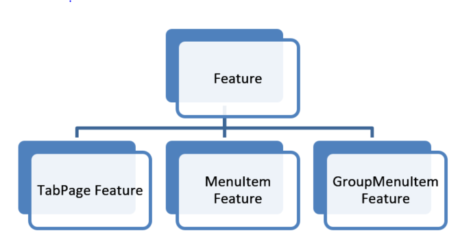
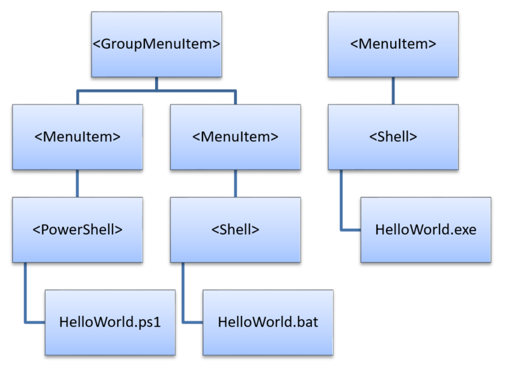
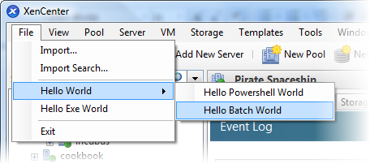
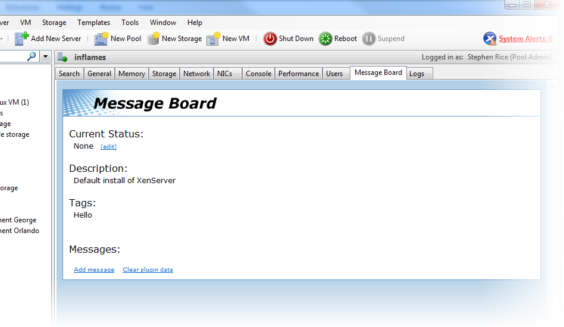

# Features

Each XenCenter plug-in can define multiple features to extend the functionality
of XenCenter for specific tasks. These features are the new menu items and tab
pages you are adding to XenCenter.


**Figure** *The Feature element has child elements TabPageFeature, MenuItemFeature,
and GroupMenuItemFeature.*

GroupMenuItem features are available to help organize your MenuItem features,
but rely on MenuItem features to provide any functionality.

## XML Attributes

All features share some common optional and required attributes that enable you
to customize their appearance and functionality.

> **Important:**
>
> The `name` attribute is required for all features. If it is not set, your
plug-in fails to load.

| Key         | Value    | Description | Optional/Required | Default  |
|-------------|----------|-------------|-------------------|----------|
| `name`        | [string] | The name for this feature. If the `label` attribute is not set, this name is used for display purposes in XenCenter. It is also used for logging. | Required | - |
| `label`       | [string] | Used as a `name` replacement for user facing display purposes in XenCenter. | Optional | - |
| `search`      | [string] | The UUID of a XenSearch defined in your configuration file. It is used for setting enablement and visibility of this feature. | Optional | - |
| `description` | [string] | A short description of this feature.| Optional | - |
| `tooltip`     | [string] | Any text you want to display a tooltip for this feature. | Optional | - |
| `icon`        | [string] | A relative path from your XenCenter install directory to an icon image for this feature. It is displayed at size 16x16. | Optional | - |

**Example:** A configuration file with a MenuItem feature using some of the common
feature XML attributes

```xml
<?xml version="1.0" encoding="UTF-8"?>

<!DOCTYPE XenCenterPlugin PUBLIC "-//XENCENTERPLUGIN//DTD XENCENTERPLUGIN1//EN" "xencenter-1.dtd">

<XenCenterPlugin
      xmlns="http://www.citrix.com/XenCenter/Plugins/schema"
      version="1">

  <MenuItem
        name="Hello Exe World"
        menu="file"
        serialized="obj"
        icon="Plugins\Citrix\HelloWorld\icon.png"
        tooltip="Says hello to the whole world"
        label="Hello"
        search="dd7fbce2-b0d4-4c61-9707-e4b0f718673e"
        description="The world's friendliest plug-in, it loves to say hello">

    <Shell filename="Plugins\Citrix\HelloWorld\HelloWorld.exe"/>

  </MenuItem>

  <Search
        uuid="dd7fbce2-b0d4-4c61-9707-e4b0f718673e"
        name="HelloSearch"
        major_version="2"
        minor_version="0"
        show_expanded="yes">

    <Query>

      <QueryScope>

        <VM />

      </QueryScope>

      <RecursiveXMOListPropertyQuery property="vm">

        <EnumPropertyQuery
              property="power_state"
              equals="no"
              query="Running" />

      </RecursiveXMOListPropertyQuery>

    </Query>

  </Search>

</XenCenterPlugin>
```

## MenuItem and GroupMenuItem

Plug-in authors can use MenuItem and GroupMenuItem features to add menu items in
XenCenter. GroupMenuItems collect your menu items under sub menus and MenuItems
launch your plug-in commands.


**Figure:** *An example hierarchy of menu items that launch various plug-in commands.*

- Each GroupMenuItem can have multiple MenuItem children
- Each MenuItem has exactly one child command which runs a target executable or script.

***Example:*** A configuration file detailing the MenuItems and GroupMenuItems
shown in the preceding figure

```xml
<?xml version="1.0" encoding="UTF-8"?>

<!DOCTYPE XenCenterPlugin PUBLIC "-//XENCENTERPLUGIN//DTD XENCENTERPLUGIN1//EN" "xencenter-1.dtd">

<XenCenterPlugin
      xmlns="http://www.citrix.com/XenCenter/Plugins/schema"
      version="1">

  <GroupMenuItem
        name="Hello World"
        menu="file">

    <MenuItem
          name="Hello PowerShell World"
          menu="file"
          serialized="obj">

      <PowerShell filename="Plugins\Citrix\HelloWorld\HelloWorld.ps1" />

    </MenuItem>

    <MenuItem
          name="Hello Batch World"
          menu="file"
          serialized="obj">

      <Shell filename="Plugins\Citrix\HelloWorld\HelloWorld.bat" />

    </MenuItem>

  </GroupMenuItem>

  <MenuItem
        name="Hello Exe World"
        menu="file"
        serialized="obj">

    <Shell filename="Plugins\Citrix\HelloWorld\HelloWorld.exe" />

  </MenuItem>

</XenCenterPlugin>
```

MenuItems which are children of a GroupMenuItem appear as a sub menu under their
group. The MenuItem validation logic still requires that the 'menu' attribute is
set for these sub MenuItems. However, the menu attribute on the parent GroupMenuItem
dictates their location.


**Figure** *The File menu shows a menu item called Hello World with subitems
called Hello PowerShell World and Hello Batch World.*

## MenuItem XML Attributes

> **Important:**
>
> - The inherited feature attribute 'name' is required. If it is not set, your
> plug-in fails to load.
> - Each MenuItem feature must contain **exactly one** child node describing a
> XenCenter plug-in command, otherwise your plug-in does not load

| Key         | Value | Description                             | Optional/Required | Default |
|-------------|-------|-----------------------------------------|-------------------|---------|
| -           | -     | [All attributes inherited from feature] | -                 | -       |
| `menu`        | One of: file, view, pool, server, vm, storage, templates, tools, help | The XenCenter menu you would like this to appear under. | Required | - |
| `serialized`  | One of: obj, global | If set to obj, the menu item disables itself if its command is already running against the selected object. If set to global, only one instance of its command is allowed to run at a time regardless of what is selected. | Optional | - |
| `contextmenu` | One of: none, pool, server, vm, storage, template, folder | An extra context menu you would like this menu item to appear under. Unless you set 'none', the item is already present on the context menu that relates to the menu attribute (if such a context menu exists). | Optional | [value for menu] |

## GroupMenuItem XML Attributes

> **Important:**
>
> The inherited feature attribute 'name' is required. If it is not set, your
> plug-in fails to load.

Each GroupMenuItem feature can contain as many MenuItem child nodes as you would like.

| Key         | Value | Description                             | Optional/Required | Default  |
|-------------|-------|-----------------------------------------|-------------------|----------|
| -           | -     | [All attributes inherited from feature] | -                 | -        |
| `menu`        | One of: File, view, pool, server, vm, storage, templates, tools, help | The XenCenter menu you would like this to appear under. | Required | - |
| `contextmenu` | One of: none, pool, server, vm, storage, template, folder | An extra context menu you would like this menu item to appear under. Unless you set 'none' the item is already present on the context menu that relates to the 'menu' attribute (if such a context menu exists). | Optional | [value for menu] |

## TabPage

Tab page features load a URL to display as an extra tab inside XenCenter. These
tabs can be used to allow access to web management consoles or to add extra user
interface features into XenCenter.

> **Note:**
>
> All local HTML and JavaScript examples in this section use the modified jQuery
> libraries for RPC calls through XenCenter in addition to the jQuery base library
? v1.3.2


**Figure** *A screenshot of the message board example plug-in.*

### TabPage XML Attributes

> **Important:**
>
> - The inherited feature attribute 'name' is required. If it is not set, your
> plug-in fails to load.
> - The 'url' attribute is required. If it is not set, your plug-in fails to load.

| Key            | Value         | Description                             | Optional/Required | Default  |
|----------------|---------------|-----------------------------------------|-------------------|----------|
| -              | -             | [All attributes inherited from feature] | -                 | -        |
| `url`            | [string]      | The local or remote URL to load the HTML page from | Required | -      |
| `context-menu`   | true or false | Whether you would like the context menu for this HTML page to be enabled. | Optional | false |
| `xencenter-only` | true or false | If set, this TabPage appears when the XenCenter node is selected in the resource list and nowhere else. | Optional | false |
| `relative`       | true or false | If set, the `url` attribute is interpreted as relative to the XenCenter install directory. | Optional | false |
| `help-link`      | [string]      | The URL to launch in a separate browser when the user requests for help on the tab page. | Optional | - |
| `credentials`    | true or false | Indicates that the webpage is using scripting and wants to use XenCenter's session credentials to interact with the server. This sets `window.external.SessionUuid` and `window.external.SessionUrl` for scripting access. **Warning:** By exposing these variables, you are allowing external webpages access to your server. | Optional | false |
| `console`        | true or false | Indicates that this tab page is meant to replace the standard XenCenter console. | Optional | false |

### TabPage Javascript API

Using some modified jQuery libraries to pass XML-RPC calls through XenCenter it
is possible for your tab page to communicate with the server using JavaScript.
XenCenter provides a scripting object which contains the following public variables:

- SessionUuid
- SessionUrl
- SelectedObjectType
- SelectedObjectRef

These variables can be accessed through the `window.external` object in JavaScript
and used to make server API calls:

```javascript
// Retrieves the other config map for the currently selected XenCenter
object and passes it on to the callback function

function GetOtherConfig(Callback)

{
    var tmprpc;

    function GetCurrentOtherConfig()

    {
        var toExec = "tmprpc." + window.external.SelectedObjectType +
            ".get_other_config(Callback, window.external.SessionUuid window.external.SelectedObjectRef);";

        eval(toExec);

    }

    tmprpc= new $.rpc(
            "xml",
            GetCurrentOtherConfig,
            null,
            [window.external.SelectedObjectType + ".get_other_config"]

    );

}
```

In this example we create an RPC object using 4 parameters:

1. Notifying that the RPC call is carrying XML (as opposed to JSON)

2. The function to execute (`GetCurrentOtherConfig`) which fires off an API call;
the modified jQuery library packages up the API call as an XML-RPC request and
hands it to XenCenter.

    Notice that the function name for the callback is passed as an extra first
    parameter to the API call.

3. We don't specify a version number for the XML (`null`) which is interpreted
as 1.0.

4. We pass a description of the API call we want to make inside
`GetCurrentOtherConfig` so the appropriate objects are created for the function
to access.

#### Required Functions

> **Important:**
>
> It is required that you define a `RefreshPage` function in your JavaScript.

XenCenter calls this function every time it reloads the HTML page or adjusts the
variables on the scripting object. Structure your code so that the `RefreshPage`
function can easily tear down and rebuild the state of the page:

```javascript
$(document).ready(RefreshPage);

function RefreshPage()

{
    // hide the error div and show the main content div

    $("#content").css({"display" : ""});
    $("#errorContent").css({"display" : "none"});
    $("#errorMessage").html("");
    RefreshMessagesAndStatus();
    RefreshDescription();
    RefreshTags();
}
```

Setting the function to be called at `$(document).ready()` ensures there are no
race conditions between XenCenter signaling to the page to refresh and the page
itself being ready to receive these requests.

#### Receiving XenCenter Callbacks

When you make an RPC object and get XenCenter to pass through an API call to the
server, you specify a callback function. When the XML-RPC request returns from
the server, XenCenter invokes the callback function and passes in a JSON object
that contains the result as a parameter. Look at `RefreshDescription` in the
following example:

```javascript
// The result object of any xmlrpc call to the server contains:
// - a result field which indicates whether it was succesfull or not,
// - a value field containing any returned data in json
// - an error description field containing any error information
// This function checks for success, displays any relevant errors, and returns
// a json object that corresponds to the value field

function CheckResult(Result)
{
    var myResult=Result.result;
    if(myResult.Status=="Failure")
    {
        var message=myResult.ErrorDescription\[0\];
        for(var i=1; i<myResult.ErrorDescription.length; i++)
        {
            message+=","+myResult.ErrorDescription\[i\];
        }
        $("#content").css({"display" : "none"});
        $("#errorContent").css({"display" : ""});
        $("#errorMessage").html(message);
        return;
    }
    if (myResult.Value == "")
    {
        return;
    }
    myResult = eval("("+myResult.Value+")");
    return myResult;
}

// DESCRIPTION UPDATE SECTION
// This pair of methods chain to retrieve the description field from the server
// and display it. There is no writing to the description field on the server.
function RefreshDescription()
{
    var tmprpc;
    function RetrieveDescription()
    {
        var toExec = "tmprpc." + window.external.SelectedObjectType +
            ".get_name_description(ShowDescription, window.external.SessionUuid, window.external.SelectedObjectRef);";

        eval(toExec);
    }
    tmprpc= new $.rpc(
        "xml",
        RetrieveDescription,
        null,
        [window.external.SelectedObjectType + ".get_name_description"])

}

function ShowDescription(DescriptionResult)
{
    var result = CheckResult(DescriptionResult);
    if (result == null)
    {
        $("#descriptionText").html("None");
        return;
    }
    $("#descriptionText").html(result);
}
```

### TabPage Replacement Consoles

This feature allows you to specify that your tab page feature replaces the
standard console tab page in XenCenter. It is often used when a VM has its own
web interface and the standard console tab page does not need to be seen.

To activate this feature, add the attribute `console="True"` to the `TabPageFeature`
tag in your configuration file.

If XenCenter cannot reach the webpage you have specified in your tab page feature,
the standard console tab page is returned and your tab page feature is hidden. If
the tab page feature can be reached later on, it is automatically restored, and
the standard console tab page hidden.
