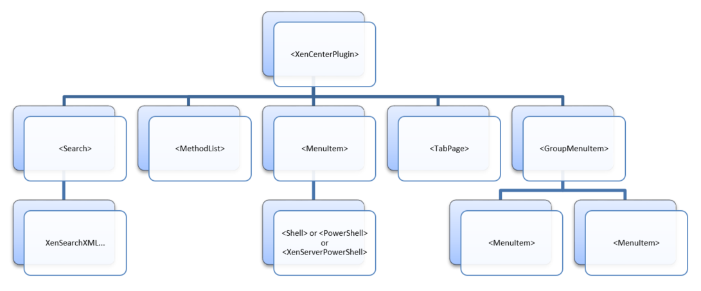

# XML Configuration File

Use your plug-in XML configuration file to define the menu items and tab items
you want to appear in XenCenter. These items are referred to as *features*, and
you can customize each one using the XML attributes described in this specification.

**Example:** A sample XML configuration file

```xml
<?xml version="1.0" encoding="UTF-8"?>
<!DOCTYPE XenCenterPlugin PUBLIC "-//XENCENTERPLUGIN//DTD XENCENTERPLUGIN1//EN" "xencenter-1.dtd">

<XenCenterPlugin
      xmlns="http://www.citrix.com/XenCenter/Plugins/schema"
      version="1"
      plugin_version="1.0.0.0">

  <MenuItem
        name="Hello World"
        menu="vm"
        contextmenu="none"
        serialized="obj"
        icon="Plugins\Citrix\HelloWorld\icon.png"
        search="dd7fbce2-b0d4-4c61-9707-e4b0f718673e"
        description="The world’s friendliest plug-in, it loves to say hello">

    <Shell filename="Plugins\Citrix\HelloWorld\HelloWorld.exe" />

  </MenuItem>

  <TabPage
        name="Google"
        url="http://www.google.com/" />

  <Search
        uuid="dd7fbce2-b0d4-4c61-9707-e4b0f718673e"
        name="HelloSearch"
        major_version="2"
        minor_version="0"
        show_expanded="yes">

    <Query>

      <QueryScope>

        <VM />

      </QueryScope>

      <RecursiveXMOListPropertyQuery property="vm">

        <EnumPropertyQuery
              property="power_state"
              equals="no"
              query="Running" />

      </RecursiveXMOListPropertyQuery>

    </Query>

  </Search>

</XenCenterPlugin>
```

If your configuration file is invalid, XenCenter logs an error and the plug-in
is ignored. You can enable, disable, and view errors with your plug-in
configuration file in the **XenCenter plug-ins** dialog.

> **Note:**
>
> Errors are only shown in the dialog when your configuration file XML can be
> parsed. If your plug-in is not listed in the dialog, use the XenCenter log file
> to debug your XML.

## Basic Structure

The XML elements in a configuration file have the following structure:


**Figure** *A hierarchy diagram. The top element is XenCenterPlugin. Its child
elements are Search, MethodList, MenuItem, TabPage, GroupMenuItem. Search can
contain XenSearch XML. MenuItem can have one of the following child elements:
Shell, PowerShell, XenServerPowerShell. GroupMenuItem can contain multiple
MenuItem elements.*

The `XenCenterPlugin` XML element is declared as follows:

```xml
<?xml version="1.0" encoding="UTF-8"?>

<!DOCTYPE XenCenterPlugin PUBLIC "-//XENCENTERPLUGIN//DTD XENCENTERPLUGIN1//EN" "xencenter-1.dtd">

<XenCenterPlugin
    xmlns="http://www.citrix.com/XenCenter/Plugins/schema"
    version="1">
...
</XenCenterPlugin>
```

With the following XML attributes:

> **Important:**
>
> The `version` attribute is required. If it is not set, your plug-in fails to load.

| Key           | Value    | Description                                               | Optional/Required | Default |
|---------------|----------|-----------------------------------------------------------|-------------------|---------|
| `version`     | 1        | The XenCenter plug-in version this plug-in was written for. Currently only version 1 is in use. | Required | - |
| `label`       | [string] | Used in XenCenter as a user-friendly replacement for the plug-in name as dictated by the directory structure. | Optional | - |
| `description` | [string] | A short description of this plug-in to show in XenCenter. | Optional          | - |
| `copyright`   | [string] | A copyright notice for this plug-in to show in XenCenter  | Optional          | - |
| `link`        | [string] | A URL web resource for the plug-in to show in XenCenter   | Optional          | - |

## XenSearch

You can include XenSearch definitions in your plug-in configuration file for
features to reference. They can use these searches to tell XenCenter when they
want to be enabled or shown.

**Example:** A MenuItem feature is using a XenSearch definition to restrict
itself to shut down VMs:

```xml
<?xml version="1.0" encoding="UTF-8"?>

<!DOCTYPE XenCenterPlugin PUBLIC "-//XENCENTERPLUGIN//DTD XENCENTERPLUGIN1//EN" "xencenter-1.dtd">

<XenCenterPlugin
    xmlns="http://www.citrix.com/XenCenter/Plugins/schema"
    version="1">

  <MenuItem
      name="hello-menu-item"
      menu="vm"
      serialized="none"
      search="dd7fbce2-b0d4-4c61-9707-e4b0f718673e">
    <Shell filename="Plugins\Citrix\HelloWorld\HelloWorld.bat" />

  </MenuItem>

  <Search
      uuid="dd7fbce2-b0d4-4c61-9707-e4b0f718673e"
      name="NotRunning"
      major_version="2"
      minor_version="0"
      show_expanded="yes">

    <Query>

      <QueryScope>

        <VM />

      </QueryScope>

      <RecursiveXMOListPropertyQuery property="vm">

        <EnumPropertyQuery
            property="power_state"
            equals="no"
            query="Running" />

      </RecursiveXMOListPropertyQuery>

    </Query>

  </Search>

</XenCenterPlugin>
```

To get a XenSearch definition into your plug-in configuration file construct it
in XenCenter, export it to a local file, and copy it into your configuration file.

## Shared RBAC Method List

When the user is connected to a server running Role Based Access Control, your
plug-in might not have permission to execute all the server API calls you need.
A method list can be defined for each command to warn XenCenter which API calls
are needed before the plug-in is even executed. See
[Commands and RBAC](commands.md) for more information.

By defining a shared RBAC method list as a child of your XenCenterPlugin node you
can have multiple commands share a common list of methods:

```xml
<?xml version="1.0" encoding="UTF-8"?>

<!DOCTYPE XenCenterPlugin PUBLIC "-//XENCENTERPLUGIN//DTD XENCENTERPLUGIN1//EN" "xencenter-1.dtd">

<XenCenterPlugin
      xmlns="http://www.citrix.com/XenCenter/Plugins/schema"
      version="1">

  <MenuItem
      name="hello-menu-item"
      menu="vm"
      serialized="none">

    <Shell
        filename="Plugins\Citrix\HelloWorld\HelloWorld.bat"
        required_method_list=”methodList1” />

  </MenuItem>

  <MenuItem
      name="hello-menu-item"
      menu="file"
      serialized="none">

    <Shell
        filename="Plugins\Citrix\HelloWorld\HelloWorld.bat"
        required_method_list=”methodList1” />

  </MenuItem>

  <MethodList name="methodList1">
      host.reboot, vm.start
  </MethodList>

</XenCenterPlugin>
```

This capability is purely for convenience and is equivalent to defining the
method list on each command separately. When both `required_method_list` and
`required_methods` are set on a command, `required_methods` takes precedence.

For syntax and further information see [Commands and RBAC](commands.md).
